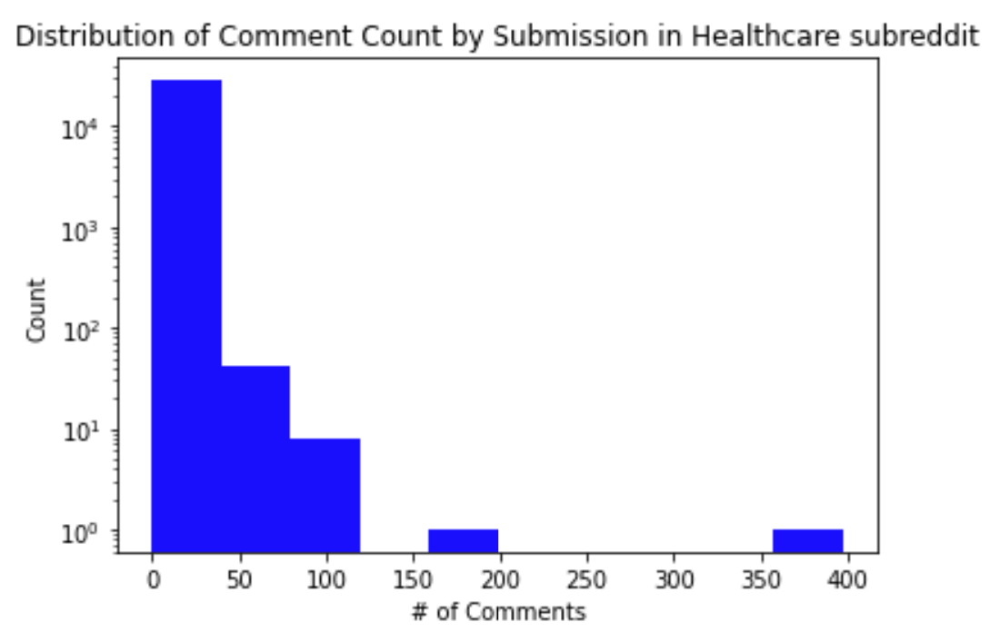

## Exploratory Data Analaysis of Healthcare Reddit Data

---

## Executive Summary

The purpose of our EDA was to identify activity patterns among users who posted and commented in healthcare-related subreddits. We also identified some of the topics that were the center of this discourse. The two primary areas of healthcare that we were interested in were reproductive rights and emergency services. 

We were interested in how discourse on reproductive rights would include key words from other topics in politics (ie. gun control), as this may give us insight into the relationship between political views and opinions on abortion. Since reproductive rights are such a controversial topic, we were able to derive lots of insight from these posts. We noticed that activity surrounding reproductive rights increased significantly during the overturn of Roe vs. Wade. Unsurprisingly, we found that discussions concerning prolife vs. prochoice appeared very frequently in the **abortion** subreddit, as well as in the **religion** subreddit. 

```{r, echo=FALSE, out.width="50%", out.height = "12.5%", fig.align="center", fig.cap="Figure 1: Counts of Keywords in the different Reproductive Rights subreddits."}

```

For our emergency services subreddit exploration, we first had to determine which diagnoses appeared the most in the subreddits (Table 3). 

```{r, echo=FALSE, out.width="20%", out.height = "10%", fig.align="center", fig.cap="Figure 2: Top 10 most mentioned ER diagnoses."}
knitr::include_graphics("../website-source/images/top_10_diags.png")
```

We hoped to see if the discourse on subreddit aligned with the most pressing issues in healthcare (ie. COVID-19, chronic illnesses, mental health, opioids, etc.), which they did. Most of the commmon issues that our analysis picked up on were either symptoms of COVID-19 or pertained to chronic illnesses and mental health issues.

Thus, our exploratory data analysis provided an excellent foundation for determining which healthcare issues were the most prevalent on Reddit, helping us encapsulate the overarching problems that permeate healthcare in the United States.

---

## Analysis Report 


**Business Questions 1 - 4: Subreddit Quality Metrics**

`Business Goal:` Develop qualtity metric for r/healthcare, a general health and healthcare discussion board. The idea is to examine the subreddit from a quality perspective to determine its usability for the average person. This analysis could be used on any subreddit to help determine quality by examining the likelihood of receiving a response, the diversity of respondents, controversiality, and consistency of activity throughout the year.

`Data Cleaning` The **r/healthcare** subreddit was utilized to try and gain a general sample of people asking health and healthcare related questions. These questions used both the submissions and comments datasets. The only data cleaning required came from the date variables, in which periods of inactivity throughout certain months had to be filled in to create plots. All other results came from aggregations. 

`Technical Proposal 1:` To accomplish the first goal, it was necessary to look at a distribution of the number of responses a given submission received.

```{r, echo=FALSE, out.width="50%", out.height = "12.5%", fig.align="center", fig.cap= "Figure 3: Distribution of the number of responses to a submission on r/healthcare."}

```

This image shows the common quantities of comments on a submission in the health care subreddit. We can see that the vast majority of posts receive 0-50 comments, but some do garner significantly more engagement. To take this further, we would compute the probability of receiving a given number of responses.

`Technical Proposal 2:` We can look at the data from an authorship perspective. By examining the number of comments a given author gave on the subreddit, we can use this as a proxy for determining the diversity of replies. For instance, if one individual answers every post, and no one else answers many, this can be problematic.

```{r, echo=FALSE, out.width="50%", out.height = "12.5%", fig.align="center", fig.cap= "Figure 4: Distirbution of the number of comments by author."}

```

This graph shows exactly the problematic element that would raise concerns. The vast majority of authors comment relatively few number of times, but one author dominated the subreddit with over 20,000 comments (out of 41,000 total). Understanding that 50% of responses come from one person is a feature of this subreddit makes it hard to trust.

`Technical Proposal 3:` The Pushshift dataset has a variable for controversiality, and we thought it was worth exploring for potential insights into what makes a post controversial. The first step is to look at the variable itself.

```{r, echo=FALSE, out.width="40%", out.height = "1%", fig.align="center", fig.cap= "Table 1: Summary Statistics of the controversiality variable in r/healthcare."}

```

This table shows highly concerning information for a variable we expected to be informative. A further look look at a histogram can hopefully shed more light.

```{r, echo=FALSE, out.width="50%", out.height = "12.5%", fig.align="center", fig.cap= "Figure 5: Distribution of controverisality variable in r/healthcare."}

```

Instead of a continuous variable, it is only 0 or 1 so determining the meaning of this variable is quite challenging. Given the proportion of 1's to 0's (.7% to 99.3%), this makes the variable essentially useless to interpret from the perspective of seeing what is controversial vs. not. The criteria for this variable is unknown and given the imbalance and discontinuous nature of the variable, our analysis on it ended here.

`Technical Proposal 4:` Lastly, we wanted to look at the activity of the healthcare subreddit over time. Ideally, a subreddit that has consistent rates of discussion over time is a desirable trait.


```{r, echo=FALSE, out.width="50%", out.height = "12.5%", fig.align="center", fig.cap= "Figure 6: Comment and Submissions activity over time on r/healthcare."}

```

One thing of note is that the submission activity actually out-ways the comments activity during peak traffic. This points to a takeaway that this subreddit appears to receive more questions then answers. In a general health discussion board, this is the inverse pattern if what an individual would want to see. 

Due to the nature of the results from this EDA on the quality of r/healthcare, we decided to scrap any next steps that came out of these questions and move to a higher quality subreddit. Despite the "failure", we can say that this lays the groundwork for somewhat effective subreddit quality analysis. Because there were no natural NLP or ML outflows of this work, development stalled here, but in theory this could be built out to evaluate any given subreddit using these metrics, and allowing users to determine whether or not a given subreddit is the right place for their question/post.

**Business Question 5**

`Business Goal:` Understand what "hot button" topics in healthcare are most discussed and how they can help us understand the most pressing health concerns.

`Data Cleaning:` Eventually, this question was expanded to include some external data on the most frequent emergency diagnoses. With the external data merged as well this data was cleaned via a Spark NLP pipeline. (For more detailed information, see the NLP tab.)

`Technical Proposal:` We used regex to search for specific topics and found counts for number of submissions per topic and number of comments per topic. Eventually, we expanded on this questions to conduct sentiment analysis for each topic (which we later classified by diagnosis).


```{r, echo=FALSE, out.width="50%", out.height = "12.5%", fig.align="center", fig.cap= "Table 2: Topic Counts"}

```

The table above shows that, from the hot button topics we have chosen to explore, Covid-related terms appear most frequently in the public health subreddit comments. This is followed by mental health terms, substances terms, vaccines terms, costs terms, and reproductive rights terms (in descending order).

**Business Question 6**

`Business Goal:` Determine how sentiment towards abortion rights was impacted over the past few months. In other words, how did the public respond to the Supreme Court overturning Roe v. Wade in June 2022?

`Data Cleaning:` The data from 3 subreddits (ProLife, ProChoice, and RoevWade2022) was collected and combined. The data was cleaned to extract time stamps from each post/comment as well as to count the number of posts/comments per time stamp.

`Technical Proposal:` The inital EDA for this data included a line chart to plot the number of posts/comments over time per subreddit and in aggregate. This allowed us to better understand how engagement with this reproductive rights topic was impacted after the leaked Supreme Court ruling. Eventually, this question was expanded to include (pre-trained) sentiment analysis on the posts per subreddit. Sentiment was also analyzed by labeling the submissions as ProLife or ProChoice which can be seen in the ML notebook.


```{r, echo=FALSE, out.width="50%", out.height = "12.5%", fig.align="center", fig.cap= "Figure 5: Time Series Plot of Activity in submissions vs. comments."}

```

In the chart above we can see that activity across the reproductive rights reddits increased over the time frame we have displayed. Most notably, comments during the month of June skyrocketed because that was around the time that the Supreme Court's draft to overturn Roe v. Wade was leaked and published in Politico. We also see how much more activity occurs in comments over time then submissions, leading to our selection of the comments data for the rest of the project.

```{r, echo=FALSE, out.width="50%", out.height = "12.5%", fig.align="center", fig.cap= "Figure 6: Activity Over Time in each of the 3 subreddits."}
knitr::include_graphics("../website-source/images/RR_activity_over_time.png")
```

In the chart above we can see how comments across all subreddits that make up our Reproductive Rights Dataset (ProLife, ProChoice, and RoevWade2022) increased after the Supreme Court leak in May of this year. With the ProLife subreddit specifically, the number of comments skyrocketed. Without further analysis we cannot say what the sentiment was but we can begin to form hypotheses about what topics and feelings were being expressed during the time frame. The above charts reveal that sentiment analysis over the past few months is worthwhile because there was a surge in activity and engagement over the past year.

**Business Question 7**

`Business Goal:` Determine whether a user’s stance on women’s reproductive rights is indicative of their stance on other high-controversy topics such as gun control. Identifying correlations between controversial beliefs reveals how approaches to and opinions around healthcare topics (such as reproductive rights) indicate other approaches and opinions towards other areas of life.

`Data Cleaning`  Regex was used to search for key words that pertained to other high controversy topics (such as gun control, abortion, and religion, etc). Boolean variables were then created to indicate the presence of certain keywords.

`Technical Proposal:` Submissions and comments were processed to determine whether other topics (such as gun control, religion, abortion, etc.) are mentioned on these subreddits (which are specifically catered for reproductive rights). The initial EDA included a visualizations of counts for posts that contained references to these other high controversy fields. Eventually, this question and analysis was expanded to include reference to more high controversy topics and those boolean variables were used to help train an ML model to predict subreddit. (See the ML notebook for more information.)


```{r, echo=FALSE, out.width="50%", out.height = "12.5%", fig.align="center", fig.cap= "Figure 7: From the chart above we can see how different keywords are used across submissions by varios subreddit. Each bar represents the percentage of submissions that include the specified keyword for that subreddit."}

```

**Business Question 8**

`Business Goal:` Determine which emergency services are the most prevalent, in order to devise more effective, targeted measures to prevent them.

`Data Cleaning:`

1. Scrape data from the **emergencymedicine**, **AskDocs**, and **medicine**  subreddits.
2. Gather the most frequent emergency medical diagnoses from [here]().
3. Use regex to find terms from posts that matched terms in the emergency medical diagnosis dataset.
4. Use groupby to count how many times each diagnosis was mentioned in our data

From our analysis, we were able to conclude that the majority of emergency medicine diagnoses came from either chronic illnessess or COVID-19. This result suggests that more measures should be taken to provide better preventative health measures to individuals so that they are less susceptible to experiencing serious symptoms from COVID-19.

```{r, echo=FALSE, out.width="60%", out.height = "15%", fig.align="center", fig.cap= "Figure 8: Most frequently mentioned ER diagnoses on Reddit."}
knitr::include_graphics("../website-source/images/top_20_diags.png")
```

The summary table above illustrates the counts of common emergency room diagnoses that were the subject of reddit comments across the three collected subreddits. Based on the data, the most prevalent cause of discussion across these subreddits is by far and away anxiety. Unsurprisingly, COVID-19 is a ranked highly, while the rest of the emergency room diagnoses appear to be symptoms associated with most chronic diseases. Thus, the table above confirms that the majority of hospital visits are actually a result of bad health, as opposed to disastrous events.

**Business Question 9 (not used)**

`Business Goal:`Learn about the sentiment surrounding different prescription drugs, so that we can see which drugs are the most popular, which drugs receive the most complaints, and which drugs are in demand

We did not complete this goal because it would require putting together an extensive list of all the prescription drugs that were frequently used in the United States and merging that with the initial public health subreddit dataset. Furthermore, the focus of our report ended up being more on the conditions themselves, rather than their treatments. 

**Business Question 10 (not used)**

`Business Goal:` Identify notable entities in the public health domain, and the sentiments surrounding these entities. 

We did not complete this goal because we found enough information in the emergency services subreddit to obtain a comprehensive understanding of the types of diagnoses and conditions that occur within the healthcare system. Instead of focusing our negative/positive sentiment analysis on public health entities, we focused our sentiment analysis on the conditions themselves to find out which conditions had the most negative impact in healthcare (see NLP section).

  

