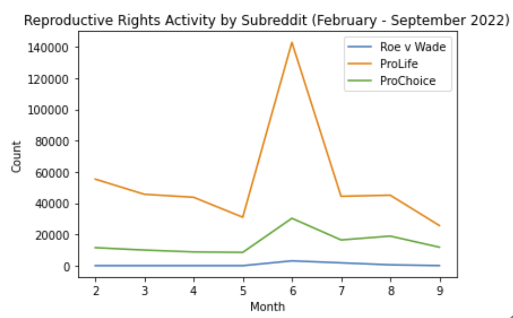

# Introduction

The [Reddit Pushshift Dataset](https://files.pushshift.io/reddit/) is a repository of all Reddit data. In this project we take a slice from January 2021 through August 2022, about 8TB of uncompressed text JSON data. The goal is to use [Spark](https://www.databricks.com/spark/about) in conjunction with [Azure Databricks](https://www.databricks.com/) to perform meaningful analysis. Throughout the project, we work through 4 milestones: EDA, NLP, and ML using a combination of the Reddit data and external data. 

Our main theme throughout all of our goals (which can be seen in the Appendix) is healthcare with a specific focus on two main subsets: the Emergency Room and Reproductive Rights. We felt these topics are not only topical, but also have a real world impacts that are worth exploring. 

With regard to the ER, the vast majority of healthcare costs come from these visits to hospitals. Identifying causes for these visits can help us understand why people go, thus allowing organizations to spread awareness and preventive health information to hopefully slow the pace of visits. Additionally, many people turn to the internet when they have health concerns, so developing a prediction algorithm that indicates an appropriate next step (which is usually not going to the ER) can help mitigate unnecessary ER visits, saving both time and money and alleviating the burden on this element of the healthcare system.

```{r, echo=FALSE, out.width="60%", out.height = "15%", fig.align="center", fig.cap= "Table 1: A plot of the Top 20 most frequently mentioned causes of ER visits on Reddit"}
knitr::include_graphics("../website-source/images/top_20_diags.png")
```

One thing that should jump out immediately is the fact that many of these health issues are not ER worthy, but nevertheless are reasons people go to the ER and discuss a lot on health related subreddits. Alleviating serious concern about many of these issues and preventing ER visits of these types can save a ton of stress, time, and money for all parties involved.

Moving on to Reproductive Rights, much debate has been had relating to pro-life vs. pro-choice. With the major Supreme Court decision *Dobbs vs. Jackson* in June, 2022, many feel that this topic is as divisive as it gets in American culture and discourse. As a result, political factions have continued to grow and passions have been inflamed. This type of behavior can actually be seen in Reddit data. 

```{r, echo=FALSE, out.width="50%", out.height = "10%", fig.align="center", fig.cap= "Table 2: Activity on Reproductive Rights subreddits"}

```

The spike in June in both the ProLife and ProChoice subreddits is unmistakable. Given the vibrant activity in these two communities and their very delineated perspectives (along with a dash of Groupthink), we investigated just how clear the boundary is between these two communities by attempting to develop an algorithm that can predict whether someone's text displays pro-choice or pro-life characteristics. In doing so, we hope to understand the groups better and provide actionable knowledge about how these groups interact. With this knowledge, it can be feasible to target either group, communicate with them effectively, and try to bring them closer together. There are also correlations between opinions on this topic and other controversial topics like religion, gun control, etc. so we hope this analysis can lead to a host of useful insights.

Last but certainly not least, this project demonstrates our learnings and use of Big Data and the tools to analyze it, as well 


## Appendix

We began the analysis with 10 goals in mind related to Healthcare - only the first 2 of which we pursued through the ML stage. The questions/goals and their associated technical proposals are:

1.

`Business Goal:` Identify the categories of emergencies that are most prevalent in medical questions. This information is relevant because the majority of healthcare costs come from patients admitted in emergency rooms. Identifying the most common reasons for these emergencies would help implement targeted prevention measures to reduce these emergencies, while also reducing healthcare costs imposed on the healthcare system. Based on a health concern, being able to predict if they should or should not take it to the ER can prove useful.

`Technical Proposal:` Using the text in the **emergencymedicine**, **AskDocs**, and **medicine** subreddits, we will be able to examine causes for medical concern. This can be accomplished by applying regex and creating Boolean variables. In order to find the relevant diagnoses, we will join the subreddit data with external data that provides a list of emergency room diagnoses (this data can be found in *data/csv/emergency_room_diagnoses_2021.csv*). New Boolean variables can then be added to determine which of these diagnoses can be identified in the subreddits, thus identifying if the concern usually ends up in the ER. We can also use sentiment analysis to determine relative severity of these diagnoses and compare. Additionally, we can develop a ML algorithm that can identify whether or not a health concern should be taken to the ER, or if calling a doctor or monitoring the concern is a better route using variables like general health topic, sentiment, and length of the concern.

2. 

`Business Goal:` Determine the characteristics that mark text as leaning pro-life or pro-choice. Identifying correlations between controversial beliefs reveals how approaches to and opinions around healthcare topics (such as reproductive rights) indicate other approaches and opinions towards other areas of life. Being able to bucket text into one category or another can be helpful for advertising, campaigns, etc. 

`Technical Proposal:` Submissions and comments can first be processed to determine whether other topics (such as gun control) are mentioned on these subreddits (which are specifically catered for reproductive rights). Using characteristics of the text such as the topics mentioned, the sentiment, and the length of the text, we can try and determine whether the author leans pro-life or pro-choice.

3. 

`Business Goal:`Determine how sentiment towards abortion rights was impacted over the past few months. In other words, how did the public respond to the Supreme Court overturning Roe v. Wade? Understanding general public sentiment (or even the sentiment of particular groups of users) would allow businesses to target advertisements or for politicians to tailor their campaigns to align with certain groups.

`Technical Proposal:` Sentiment analysis on posts (and/or comments) can be evaluated using out-of-box sentiment analysis models by first cleaning the data and selecting a sentiment analysis learning model to process the data. Results from the sentiment analysis will be visualized. Sentiment can also be analyzed by labeling the submissions as ProLife or ProChoice (from their respective subreddits) and we can then apply classifier algorithms to understand whether the sentiment of ProLife and ProChoice submissions are similar to their respective subreddits.

4. 

`Business Goal:` What hot button topics in healthcare are most discussed and how can they help us understand the most pressing health concerns? This could be helpful for insurance companies when considering what should be covered in new health plans/packages. It could also be useful for politicians on the campaign trail who want to understand the main concerns of their constituents with respect to public health.

`Technical Proposal:` Regex to query topics, find counts for number of submissions per topic and number of comments per topic, conduct sentiment analysis for each topics and look at proportions of positive to negative in each subcategory. This approach will help us identify what topics are the most talked about and how theyre being discussed.

5. 

`Business Goal:` Determine the likelihood of getting a response to a general health question on Reddit. This would help quantify the usefulness of this subreddit in terms of offering responses/answers to people seeking advice on health-related topics. When choosing a subreddit in which to post, knowing your likelihood of recieving a response is extremely useful information to inform your choice to engage with one specific subreddit over another.

`Technical Proposal:` Using the subreddit AskReddit, examine the likelihood of a response. Compute the distribution of number of comments per post. Examine whether the length of the submission impacts the likelihood of receiving a response. Will perform bootstrap sampling to determine an expected number of comments per submission as well as an associated confidence interval. Present findings as an expected number of comments on a submission to r/healthcare.

6.

`Business Goal:` Determine the expected diversity of responses (variety of unique authors) on a general health-related question posed to Reddit. Author diversity analysis will serve as a metric for evaluating the breadth and depth of information available on the healthcare subreddit. This will help establish the viability of this subreddit as a health information forum.

`Technical Proposal:` Using the healthcare subreddit, examine the diversity of replies in terms of who is generating the responses and the average quality of their responses. This entails computing the distribution of activity by author, determining leaders, and computing their average response length. This helps avoid the issue of a spam person putting a bunch of one word responses to questions. Present findings as a table of top n authors - the % of total responses they are responsible for, and their average response length.

7.

`Business Goal:` Examine controversiality as it relates to healthcare. For instance, determining which words are most associated with high controversiality score can help identify potentially polarizing or incindiary information. For example, posts discussing health privacy (medical data/HIPPA violations), discrimination, anecdotal trauma/negative experiences are examples of potentially divisive topics. This information might be useful for organizations that are interested in tracking information censorship. For example, say there is an organization who's mission is to ensure that platforms protect free speach. Suppose they suspect that reddit is supressing controversy (and therefore limiting diversity of responses), these topics might be the ones they are most interested in tracking. 

`Technical Proposal:` Tokenizing words found in posts with high controversiality scores. Performing sentiment analysis and topic modelling and/or named entity recognition can help display which entities are the most controversial and why. Present results as a series of tables and graphs showing the most controversial entities. Look for patterns that will help draw insights about health-related controversy. 

8. 

`Business Goal:` Determine the trends of public discourse related to healthcare with respect to a specific time of year. Using this information for marketing efforts, program rollouts, etc. can help to make these initiatives more aligned with periods of interest.

`Technical Proposal:` The healthcare subreddit is a place for general healtchare questions seeking answers from the Reddit community. As a result, activity trends should represent a sample of general activity related to healthcare discourse throughout the year. Date variables will be created and then activity levels grouped by month will be computed.

9. 

`Business Goal:`  Collect discourse about prescription medicines (ie. accessibility, cost, demographics) in order to identify:
 + Which medicines are most effective, meaning they should continue to be made by pharmaceuticul companies, and perhaps covered by insurance companies.
 + Which medicines are most expensive, and thus should be covered more by insurance. 
 + Which medications (ie. antidepressants, anti-anxiety, etc.) are most prevalent, to see which medical conditions are treated the most frequently. Identifying the category of disease that the medication treats will help identify areas in medicine that require more pharmaceutical research.

`Technical Goal:`  We will also use previously created sentiment analysis models to determine whether people are pleased or displeased with the medications they are talking about. Use regex to extract medication names, the conditions they are used for, and perhaps discussions on whether they are expensive or not. An external dataset (found in *data/csv/drug_uses.csv*) can be used to connect the medication name with category of diseases that the medication is used to treat. 

10. 

`Business Goal:` What organizations, people, and locations are mentioned in the public health space? Identifying notable entities would be imperative to funding initiatives for groups that want to strategically fund public health issues. For example, if a philanthropic organization looking to target funding to healthcare institutions (like planned parenthood, clinics, etc) in a specific state, they might look at which states appear most in these posts. Similarly, if they wanted to financially back a politician/researcher/doctor/leader to help further their work public health, they might look at which people appear to be most prominent in the healthcare space. Essentially, this would be a research tool to aid institutions/individuals in understanding the key entities in healthcare (whether it be person, place, or org).  


`Technical Proposal:` Use spaCy's NER package to identify notable entities in the healthcare domain. We would extract entities from the public health subreddit that are classified by spaCy as ORG (organization),  PER (person), or LOC/GPE (location/geopolitical entity) and analyze these categories individually. Once we have the data for these three classifications, we calculate volume/frequency of mentions and would perform sentiment analysis on the posts containing each entity type, respectively, to determine if the entity is being discussed in a positive or negative manner. For example, if we find that Donald Trump and Anthony Fauci are mentioned in the posts in our in our PER data subset, we would explore the sentiment of the surrounding context where each entity appears to understand the valence (pos/neg). Once we have pos or neg valence classifications for each mention of a person, we can find the overall sentiment ratio and volume of mentions across all posts where that individual appears. The same approach applies for LOC/GPE and ORG. One interesting thought for visualizing the location entities is to extract them, map them to their geo coordinates (lat long), and visualize them on a geospatial map. 