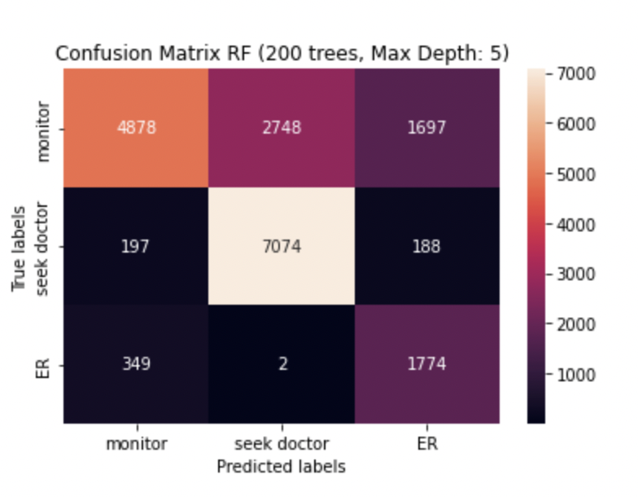
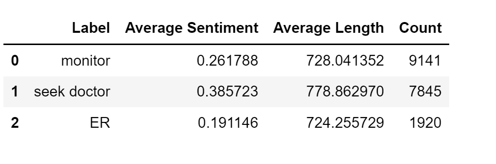
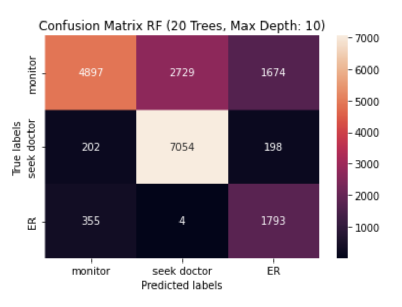
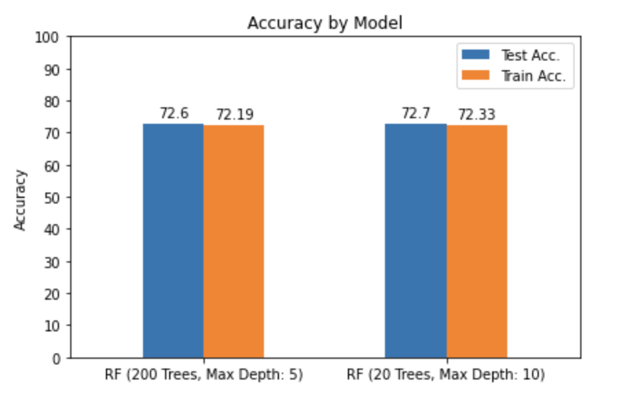
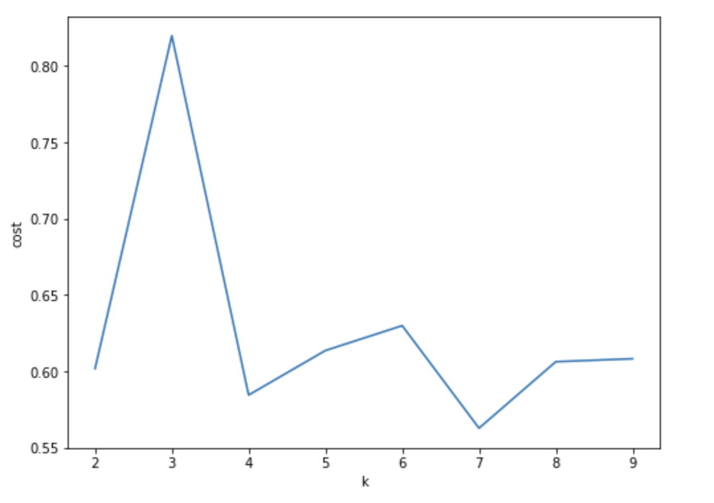
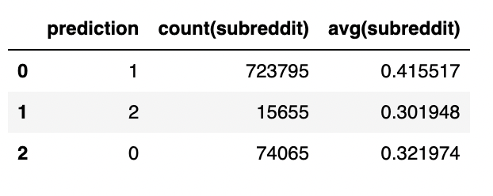
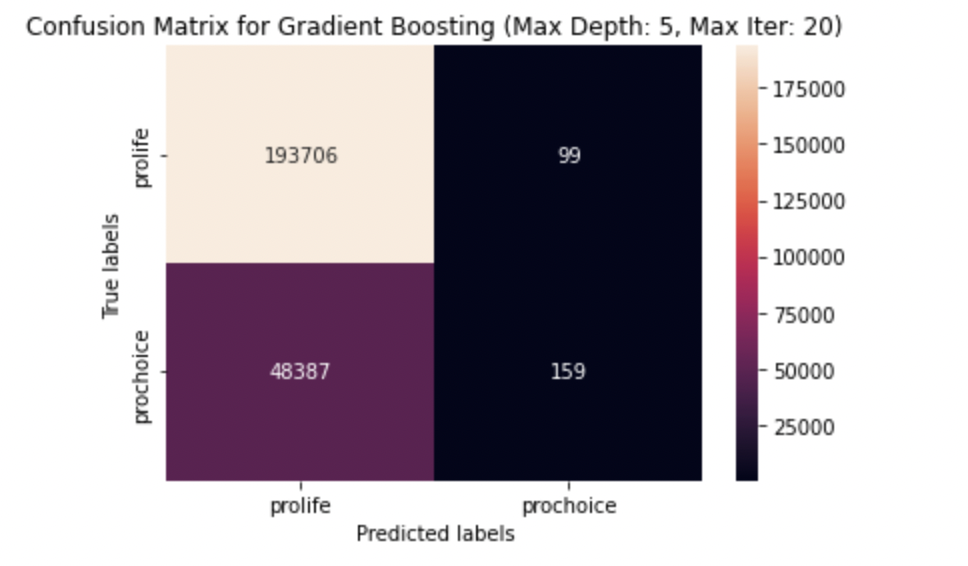

## ML Milestone

---

## Executive Summary

For this milestone, we used machine learning methods to make predictions about novel health-related Reddit posts related to emergency room topics and reproductive rights, respectively. Thus, we propose two business goals (discussed in greater depth in subsequent sections of this report). The code for this milestone can be found [here.](../code/ml/ml_reddit.html)

The first business goal aims to predict the severity of ailments discussed in medical-related questions in order to better inform individuals about the urgency of their concern and to hopefully limit ER visits only to genuinely urgent issues. We found that most of the posts discussed issues pertaining to the less-severe categories, with the ER-related issues making up the smallest part of our data. We were able to correctly predict illness severity in ~73% of cases. However, it appears that our model leans on the side of caution, occasionally misclassifying lower severity cases as more severe than they are.     

The second business goal aims to understand the extent to which pro-life and pro-choice subreddits overlap. Are these two groups really as different as one might assume? In order to pursue this goal, we utilized machine learning methods to discern similarities and differences between the posts in each group. We wanted to see how closely related the groups were in terms of their ability to be grouped together in similar clusters. If the posts are able to be grouped into non-overlapping clusters, this would imply that they are truly different in terms of post content. On the other hand, if we are unable to discern clear groupings between these factions, perhaps they are more similar in content than expected. The result of the Kmeans was very interesting. Although three clear groupings were found, they were not homogenous in terms of the subreddit to which they belonged. In other words, Kmeans clustering showed that our data was clusterable, but not based on the reproductive rights labels that we were expecting. 

---

## Analysis Report


## Analysis 1: Predicting Severity of Health-Related Reddit Comments

`Business Goal 1:` Identify the severity of ailments discussed in medical-related questions. This information is relevant because the majority of healthcare costs come from patients admitted in emergency rooms. Identifying the most common reasons for these emergencies would help implement targeted prevention measures to reduce these emergencies, while also reducing healthcare costs imposed on the healthcare system. Based on a health concern, being able to predict if they should or should not take it to the ER can prove useful both to afflicted individuals and medical personnel.

`Technical Proposal:` Using the text in the emergencymedicine, AskDocs, and medicine subreddits, we will be able to examine causes for medical concern. In past deliverables, we've shown that this can be accomplished through NLP methods. In this machine learning deliverable, we continue to use the subreddit dataset that we joined with external emergency room data (list of emergency room diagnoses. this data can be found in data/csv/emergency_room_diagnoses_2021.csv). We plan to implement two approaches to the Random Forest algorithm in order to identify whether or not a health concern warrants an immediate ER visit, calling a doctor, or should simply be monitored. Building on the sentiment analysis performed in the NLP deliverable, we plan to use the new sentiment column (0=negative, 1=positive) in addition to other variables like general health topic, and length of the post to train our model. The goal of the Random Forest model is to classify posts as one of three severity categories: Monitor, Seek Doctor, and ER.  

We implemented two approaches to the Random Forest algorithm in order to classify the severity/urgency of medical-related posts on reddit. This analysis is intended to provide an accurate assessment of urgency to users who are seeking medical advice on redit. For example, take someone who is complaining of a headache and considering rushing to the ER immediately because they fear it's deadly; our analysis would deem this post as the lowest severity ('monitor') and reassure the user that they are simply experiencing a run of the mill headache that likely does not require immediate emergency room care. Not only would this benefit individual users, it would also ostensibly prevent emergency rooms from becoming clogged with less severe ailments. By creating a machine learning algorithm to predict illness severity based on reddit posts, we hope to create an accurate system for classifying gradations of medical severity. This has various positive implications including those mentioned above.     

*Data pre-processing:* 

We utilized the ER diagnoses sentiment data, adding a new column to specify the length of each post. We conditionally grouped the posts into three lebel categories (ER, seek doctor, monitor) based on the ems topic to which they pertained. Less severe topics such as dizziness were mapped to the least severe label (monitor), slightly more severe topics such urinary tract infection were mapped to the next severity label (seek doctor), while highest priority topics such as heart failure were mapped to the most severe label (ER). We also generated a new variable to further classify the ems topics into 6 major categories: stomach, substance, chest, chronic, mental, other. This variable (general topic) is used as an additional feature to train the Random Forest model. 

*Data exploration:*

Initial EDA revealed that the aforementioned categorization methods resulted in an uneven label distribution, with ER being by far the smallest category. Thus, we chose to compute class weights and add them to a new column in the data set in an attempt to balance the model. Thus, EDA revealed the need for data normalization.  

## Model 1a - Random Forest #1

The first of the two Random Forest models was built to generate 200 trees with a specified maximum depth of 5. We split the data into training and testing sets (80% and 20%, respectively). Working with the test set, we applied string indexing on columns sentiment, gen_topic, and label. We encoded the sentiment and topic using One Hot Encoder, generating a sparse vector representation of the data. We generated a feature vector containing sentiment, length of the comment, and general topic variables. The feature vector was normalized using Euclidean distance. These steps comprised our data pipeline (string_sentiment, string_gentopic, string_label, onehot_sentiment, onehot_gentopic, vectorAssembler_features, normalizer, rf, labelConverter). We then fit the training data to the pipeline. After predictions were made from the test data, our results were as follows: 

Train Accuracy = 0.72187, Train Error = 0.27813

Test Accuracy = 0.725975, Test Error = 0.274025


```{r, echo=FALSE, out.width="60%", out.height = "15%", fig.align="center", fig.cap= "Plot 1: A Confusion Matrix of Random Forest #1 Classifiier Accuracy"}

```
*Takeaways from First Random Forest Results:* 'monitor' class performed worse than 'seek doctor' or 'ER'. Thus, the model is better at predicting more severe categories. It appears that this model leans on the side of action, often misclassifying lower severity cases as more severe than they are. This is a conservative algorithm that generally heirs on the side of caution.  

Interestingly, however, the majority of incorrectly predicted ER all were monitors. Further investigation revealed that the average sentiment score for predicted and actual ER diagnoses is much lower than either of the two less severe groups (see table 1 below). Additionally, the post length for ER diagnoses is also lower than the other groups. 'Monitor' being closer to 'ER' may indicate that the ems_topics pertaining to each category might need to be tweaked in order to more accurately represent the data. 

```{r, echo=FALSE, out.width="60%", out.height = "15%", fig.align="center", fig.cap= "Table 1: A Plot Showing Average Sentiment Distribution (among other variable info)"}

```
## Model 1b - Random Forest #2 

The second Random Forest model was built to generate only 20 trees (instead of 200), each with a maximum depth of 10 (instead of 5). This model was generated by modifying these hyperparameters from the original pipeline mentioned above (satisfying the **PIPELINE BONUS** option). Accuracy results are as follows:

Train Accuracy = 0.723331, Train Error = 0.276669

Test Accuracy = 0.726965, Test Error = 0.273035


```{r, echo=FALSE, out.width="60%", out.height = "15%", fig.align="center", fig.cap= "Plot 2: A Confusion Matrix of Random Forest #2nClassifiier Accuracy"}


```
## Model Comparison: Random Forest with Different Hyperparameters
```{r, echo=FALSE, out.width="60%", out.height = "15%", fig.align="center", fig.cap= "Plot 3: A paired bar chart comparing  train,test Accuracy for two diff RF models"}


```

Random Forest #2 had fewer - but deeper - trees. Note that deeper trees may be prone to over fitting. Despite the posibility of over fitting, this model showed a slight increase in accuracy compared to the first.

---

## Analysis 2: Estimating Similarity Among Reproductive Rights Groups

`Business Goal 2:` Determine the characteristics that mark text as leaning pro-life or pro-choice. Identifying correlations between controversial beliefs reveals how approaches to and opinions around healthcare topics (such as reproductive rights) indicate other approaches and opinions towards other areas of life. Being able to bucket text into one category or another can be helpful for advertising, campaigns, etc.

`Technical Proposal:` Submissions and comments can first be processed to determine whether other topics (such as gun control) are mentioned on these subreddits (which are specifically catered for reproductive rights). Using characteristics of the text such as the topics mentioned, the sentiment, and the length of the text, we can try and determine whether the author leans pro-life or pro-choice.


## Model 2a - K Means 

*data preparation:*

K-means is a supervised learning clustering algorithm. We used six attributes (variables) to conduct K-means clustering for the reproductive rights portion of this analysis in order to address business goal 2. The attributes on which the model was trained are as follows: "subreddit", "Abortion", "Guns", "Religion", "Sentiment", "Length". Attributes must be numerical or discrete for this analysis, hence the need to cast columns to the appropriate data representation. For example, "subreddit" and "sentiment" columns were converted from character to boolean ([0=ProLife, 1=RoeVsWade, 2=ProChoice] and [0=Negative, 1=Neutral, 2=Positive], respectively). Once all attributes of interest have been converted to numerical or discrete numeric types, we are able to transform them into useable features using a vector assembler. Once all columns have been transformed into a single feature vector, we then need to standardize the data to bring them to a comparable scale (values were all converted to a 0-1 scale). Once our data is standardized we can develop the K Means algorithm...

```{r, echo=FALSE, out.width="60%", out.height = "15%", fig.align="center", fig.cap= "Plot 4: sillhouette score for kmeans"}

```


Silhouette score takes into consideration the intra-cluster distance between the sample and other data points within the same cluster *a* and inter-cluster distance between the sample and the next nearest cluster *b*. A silhouette score of 1 means that the clusters are very dense and nicely separated. A score of 0 means that clusters are overlapping. A score of less than 0 means that data belonging to clusters may be wrong/incorrect. The image below shows that the silhouette scores from k=2 to k=9 ranged from about 0.56 (at k=7) to 0.82 (at k=6). The average score across all values of k was approximately 0.63. The maximum score at k=3 indicates that there are three fairly distinguished clusters in our data. 

As per the above silouhette scores, we ran K means on with k=3. We initially assumed that the three clusters aligned with our three subreddits ("pro choice", "pro life", "Roe v Wade"). However, if this were the case, average subredit score in each cluster would be close 0,1, and 2, respectively. However, the average label scores are relatively evenly distributed across the groups, indicating that each cluster contained a heterogenous sample from our three subreddits of interest. Additionally, the avg(subreddit) column in table 2 below shows that the average predicted subreddit score was relatively close to 0 across all 3 groups. In other words, 0 (pro-life) was the most often predicted category across all clusters. Together with the high sillhouette score at k=3, this result indicates that although there were three distinct clusters in our data, they were not characterized by subreddit labels. This means that the data is separable overall, but is not necessarily distinguishable based on the subreddit to which it pertains. Instead, it is separable by some other (or various other) attributes. This is a fascinating result because it indicated that subreddit alone is not enough to distinguish posts between the pro-life, pro-choice, and RoevWade reddit groups. 


```{r, echo=FALSE, out.width="60%", out.height = "15%", fig.align="center", fig.cap= "Table 2: Results Table of Kmeans Predictions"}

```

## Model 2b - Gradient Booosted Trees


For our last model, we used a Gradient Boosting algorithm to predict whether a post belonged to either the pro-life or prochoice subreddit, based on whether the  words ‘Abortion', 'Guns', 'Religion', 'Politics', 'Democrat', 'Republican', or ‘RoeVWade' appeared in the post. Additionally, the sentiment and the length of the post were used as additional attributes to help with this categorization.

The gradient boosting model predicted the correct subreddit with 80% accuracy. Our confusion matrix indicates that the model was better at categorizing pro-life posts. This may be a result of more pro-life posts being available on Reddit as well as the variables we chose being more representative of pro-life posts.


```{r, echo=FALSE, out.width="60%", out.height = "15%", fig.align="center", fig.cap= "Plot 5: Confusion Matrix for Gradient Boosted Trees"}

```

---

## ML Conclusion

From our ML analysis we can conclude 3 major takeaways:

1. Random Forest models - we can confidently say that post length, general topic, and sentiment  is enough to have a decent predictability for illness severity. Even with limited information we can conduct severity prediction with relative effectiveness. It shows promise for a company to build upon and deploy in the real world.  

2. Kmeans - our data was clusterable, but not based on the reproductive rights labels that we were expecting. 

3. Gradient Boosting -  predicted the correct subreddit (pro-life vs. pro-choice) with 80% accuracy. However, it was far superior at predicting pro-life posts than pro-choice. 

