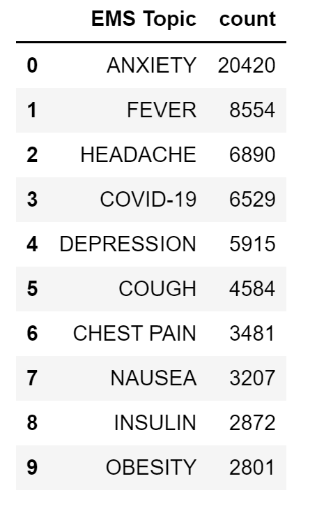
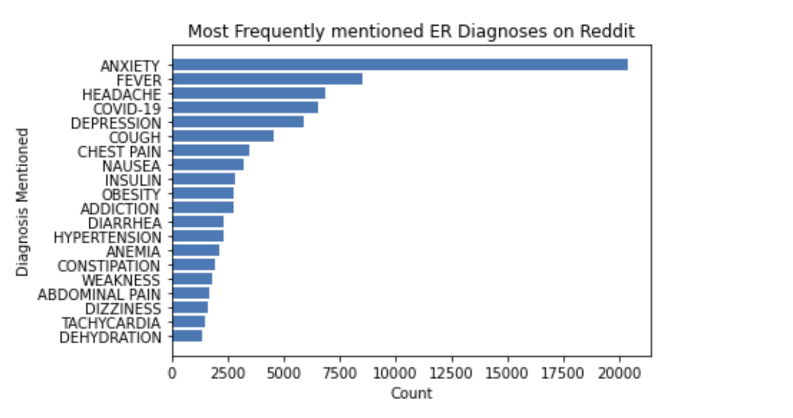
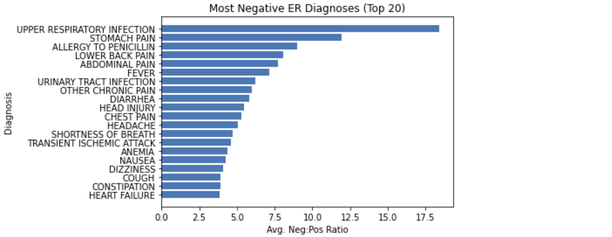

# NLP Milestone

## Executive Summary
For this milestone, we used NLP methods to analyze the content of Reddit posts (gathered from the Pusshift dataset) whose topics focused on medical emergencies and medical questions. Our analysis allowed us to identify the main categories of discourse present on Reddit, such as major key words and the sentiment surrounding these keywords. The Jupyter Notebook for this milestone can be found [here.](../code/nlp/nlp_reddit.html)

We found that the most prevalent diagnoses were fairly common symptoms, with the top five being anxiety, fever, headache, COVID-19, and depression.

```{r, echo=FALSE, out.width="20%", out.height = "5%", fig.align="center", fig.cap= "Table 1: The above table lists the top 10 most frequent diagnoses and their counts found in the specified subreddits."}

```

Further analysis showed that the diagnoses associated with the greatest comment length were postprocedural, drug therapy, addiction to nicotine, immunization, and type 2 diabetes.

```{r, echo=FALSE, out.width="60%", out.height = "15%", fig.align="center", fig.cap= "Table 2: Illustrates the average length of a comment that has been labeled as a particular Diagnosis Mentioned. Greater average comment length suggests more detailed information and context given the Diagnosis Mentioned, and more relevance to that Diagnosis as a significant factor in population health."}

```

These results suggest that across Reddit, users share a lot about the symptoms they may be having, and they tend to discuss conditions that are either chronic (ie. type 2 diabetes) or controversial (ie. immunization) with greater detail.

Preliminary TF-IDF did not deliver much insight, but sentiment analysis proved particularly helpful when determining whether the discourse about certain conditions was more positive or negative. 71.29%  of the posts were labeled as negative, with the most negative sentiment being associated with symptoms of more serious illnesses (ie. COVID-19). In contrast, positive sentiment stemmed from conditions that were associated with long-term recovery or treatment plans.

Thus, our NLP analysis suggests that individuals use Reddit mostly to complain about symptoms that they are experiencing, but occasionally use Reddit as a platform to share their progress when treating or recovering from an illness.


## Analysis Report

Understanding and responding to medical emergencies is foundational to understanding–and hopefully improving–the healthcare system at large. We looked at posts from the emergencymedicine, AskDocs, and medicine subreddits in order to examine causes for medical concern. We expanded our initial data collection to include the AskDocs and medicine subreddits to increase the amount of relevant posts to analyze. In order to find the relevant diagnoses, we joined the subreddit data with external data that provides a list of emergency room diagnoses (this data can be found in data/csv/emergency_room_diagnoses_2021.csv, sourced from [here]()). To help with NLP analysis, two new dummy variables were added to the data. The first new dummy variable indicated whether multiple diagnoses were present in the same post, and the second dummy variable indicates whether these diagnoses were fatal.

The purpose of our NLP analysis is to identify the categories of medical emergencies and medical questions that are most prevalent in Reddit discourse, as well as the sentiment surrounding these topics. This information is relevant because the majority of healthcare costs come from patients admitted in emergency rooms. Additionally, patients with chronic conditions will experience symptoms for months before actually seeking help, which either warrants a more expensive treatment of the disease or an additional trip to the emergency room. Identifying the most common reasons for these emergencies would help implement targeted prevention measures, reducing healthcare costs imposed on the healthcare system.

The first part of our data analysis labeling each post with a certain medical topic (Table 1) and illustrating which topics were the most prevalent. Based on the data, the most prevalent topic of emergency medical discussion is anxiety, with 17,416 mentions. Fever is a relatively close second, while the rest of the mentions surprisingly have to do with general health and non-acute events. 

```{r, echo=FALSE, out.width="60%", out.height = "15%", fig.align="center", fig.cap= "Table 3: Plot of the Top 20 most frequently mentioned causes of ER visits on Reddit"}

```

Thus, the table above suggests that the majority of hospital visits are actually a result of bad health, as opposed to disastrous events.
Our second step in NLP analysis was to understand the extent through which each topic was discussed. For instance, even though anxiety was the most frequently discussed topic, this was just because it appeared in the greatest number of posts. Instead, postprocedural recovery and drug therapy were the topics that had the greatest depth of discussion  (Table 2).

The length of a comment could be interpreted as positive or negative. For example, with regards to post-procedural recovery having the greatest average comment length, a positive interpretation suggests that people are going into great detail to share their postprocedural recovery on Reddit. This could be a result of people enjoying sharing progress to their loved ones over social media. A negative interpretation suggests that people are actually complaining about their postprocedural recoveries. Even worse, these comments could be result of people having such bad postprocedural experiences that they have to return to the emergency room, shedding a much greater and more ominous light on the state of the quality of healthcare that patients receive in the United States. 

Furthermore, every diagnosis in Table 2 has an average comment length above the overall mean comment length of 746 words, which shows that these topics do spark a lot of discussion, and are one of the few topics that do so given the positive skew of the comment length data.

```{r, echo=FALSE, out.width="30%", out.height = "4%", fig.align="center", fig.cap= "Table 4: The summary statistics for the comment length of our data. Since the median is much smaller than the mean, this suggests that the data is positively skewed. Positive skew suggests that most of the comments are shorter in length, but there are a few comments that are significantly longer."}
knitr::include_graphics("../website-source/images/length_dist.png")
```

Our next step was to prepare our data for more formal NLP analysis, using cleaning processes defined by SparkNLP. To highlight five of the cleaning processes we employed, we …

**Cleaned the text of special characters, numbers, usernames, etc.** We used a cleaning function that we wrote to regex match patterns that we wanted to remove such as newline characters (\n) and digits (0-9).

**Used a document assembler.** This prepares data into a format that is processable by Spark NLP. This is the entry point for every Spark NLP pipeline. The DocumentAssembler can read either a String column or an Array[String]. Additionally, setCleanupMode can be used to pre-process the text.

**Used a sentence detector.** The task of sentence boundary detection is to identify sentences within a text.
Tokenized our input data. Tokenization involves splitting our input string into an array of tokens that make up the input. This allows us to look at our data word by word (or more aptly, token by token).

**Removed stopwords from our data.** Stopwords are words that bear not relevance or significance to our text. They include words like “like,” “and,” “to,” and “for.”

Preliminary results of the sentiment analysis on our cleaned data labeled 71.29% of the posts as negative, 26.62% as positive, and 2.09% as neutral.

```{r, echo=FALSE, out.width="20%", out.height = "2.5%", fig.align="center", fig.cap= "Table 5: Results of sentiment analysis show that most of the posts in the emergencymedicine, medicine subreddits are negative."}

```

We also performed TF-IDF analysis to rank the importance of certain words:

```{r, echo=FALSE, out.width="65%", out.height = "20%", fig.align="center", fig.cap= "Table 6: Results of TF-IDF analysis showed that among some Reddit ‘junk’ words, the medical terms that have the greatest importance are either related to headaches, coughing, or fatigue."}
knitr::include_graphics("../website-source/images/tf-idf.png")
```

The ranking of word importance did not allow us to make any conclusions, as some of the most ‘important’ words could be considered ‘junk’ words. However, the medical terms that had the greatest significant in the TF-IDF analysis could easily be associated to symptoms of COVID-19 (headaches, coughing, fatigue). 

Sentiment analysis provided much more insight on our data, compared to TF-IDF. Since we knew the most frequently discussed conditions (Table 1), as well as how much discourse surrounded each condition (Table 2), the most intuitive question to answer next is whether that discourse was mainly positive or negative. Thus, Table 7 shows which diagnoses warranted the greatest ratio of negative to positive sentiment, while Table 8 shows which diagnoses warranted the greatest positive to negative sentiment. 

```{r, echo=FALSE, out.width="70%", out.height = "20%", fig.align="center", fig.cap= "Table 7: Ratios of negative to positive sentiment for medical diagnoses."}

```

```{r, echo=FALSE, out.width="60%", out.height = "15%", fig.align="center", fig.cap= "Table 8: Ratios of positive to negative sentiment for medical diagnoses."}

```

From our NLP analysis, we may conclude the following: diagnoses that had the greatest negative to positive ratio represent the diagnoses that people are most likely to complain about. This conclusion is supported in Table 1, where there is a lot of overlap between the conditions that have the most negative sentiment and the ones that appear the most frequently throughout the data. In contrast, the diagnoses that have the greatest ratio of positive sentiment have more overlap with the conditions that are associated with more of a chronic care plan, or a recovery journey. Thus, our data suggests that the discourse on Reddit is not just a source of complaints and pain, but one where people can share their progress on their paths to recovery from medical afflictions. 


