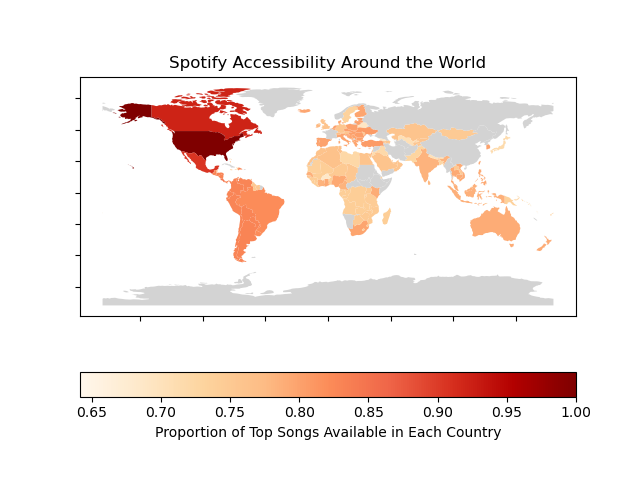

```{r setup, include=FALSE}
knitr::opts_chunk$set(echo = TRUE)
```

## Introduction

Spotify is one of the most widely used music streaming platforms in the world. Much of Spotify’s appeal (compared to platforms such as Apple Music, for example), is its striking ability to take user data and suggest songs/make accurate inferences about user preference. This data-driven service yields features such as ‘Discover Weekly’ and ‘Spotify Blend.’ 

While Spotify seems to store and analyze data behind the scenes to enhance user experience, the average user is unable to access data on their own listening habits (let alone the habits of others). This project aims to harness Spotify’s data to answer questions about global and personal listening trends. This feature will utilize geospatial data provided by the Spotify API (SpotiPy) in order to examine global listening trends, allowing users to specify a geographical location and learn about that region’s preferences. Additionally, we hope to include personal user data, thus allowing a user to input their information and learn about their personal listening trends. Our interactive visualization will likely be in the form of a network graph of clusters showing relationships between streamed songs (either the user’s personal streamed songs or the songs streamed at a specific geographical location which will be specified by the user). It will provide information about favorite genre(s) and artist(s), most popular songs, songs that are often streamed together/in succession, etc.

The goal of our project is to allow the user to examine the current landscape of music, as well as arm them with the tools they need to analyze their own music. Through our narrative, the user will see what the most popular genres of music are over the past decade, and what characteristics are associated with them.

## Methods

As a popular streaming platform, Spotify has an abundance of informative and interesting data to digest. 
We have focused our Spotify analysis on 3 key data sets.

#### **Data Collection**

1. **Top Spotify Songs from 2010-2019:** This dataset lists the top songs by year across the world
and was used in [Figures 1](#figure-1), [2](#figure-2), [3](#figure-3), and [4](#figure-4). 
There are various other variables (such as Title, Artist, Top Genre, and more) 
and the song rankings are based on Billboard’s rankings. The link for this dataset can be found [here](https://www.kaggle.com/leonardopena/top-spotify-songs-from-20102019-by-year).

2. **Map Data:** This visualization was generated in a multistep process which included 2 open source data sets and one datset from the Spotify API containing data on the availability of songs across the world. The [first open source dataset](figures-1/country_codes_and_coordinates.csv) contains country names, 3-letter (Alpha-3) country codes. 
The [second open source dataset](figures-1/Map.csv) contains 2-letter (Alpha-2) country codes.

3. **Spotify Dataset:** This dataset rates songs on Spotify by different scores for liveliness, energy, loudness, etc. 
The data is further classified by genre and duration. The link for this dataset can be found [here](https://www.kaggle.com/lehaknarnauli/spotify-datasets?select=tracks.csv).

4. **Personal Spotify Data:** Personal streaming data from the past year was requested 
and collected by one of our group members (Nina) from Spotify. This data was 
used for [Figures 5a, 5b, and 5c](#personal).


#### **Data Cleaning**

1. **Top Spotify Songs from 2010-2019:** This data was already clean, but
 this dataset was also used to generate the location ids for each country that
the songs were available for streaming in. We wrote [code](figures-1/Get_locations.py)
to generate a new [csv](figures-1/Map.csv) that contained the country codes for each song. 
This csv file was then used in our [map-making code](figures-1/fig-1.py),
which generated our chloropleth map ([Figure-1](#figure-1)).

2. **Map Data:** Since [csv](figures-1/Map.csv) originally had Alpha-2 codes, 
we needed the first open source dataset as an intermediate to convert Alpha-2 codes 
to Alpha-3 codes. Once this was completed, we were able to merge the dataset  with the pre-made geopandas world map coordinate data (via outer join) to create a final dataset containing country name, country geometry, and Alpha-3 codes. This dataset is in geopandas dataframe format, allowing us to plot it onto the world map with color encoding the availability of the top songs by country

3. **Spotify Dataset:** This data did not need to be cleaned.

4. **Personal Spotify Data:**
The streaming history data that was collected from Spotify initially
was in the form of three json files:

[2021-02-15 to 2021-08-28](figures-5/StreamingHistory0.json)

[2021-08-28 to 2022-01-06](figures-5/StreamingHistory1.json)

[2022-01-06 to 2022-02-15](figures-5/StreamingHistory2.json)

These files did not have the specific URIs that were necessary to access the 
songs from the Spotify API, so we had to write [code](figures-5/streaming_history_csv.py) 
that would use the song name and the artist name to search through the Spotify API, 
access the song id, and then attach that song id to the correct song from the json file.
The last step was to convert the json file into a csv file, as this would
allow us to use plotly. 

The resulting csv file for Nina's Streaming History can be found by clicking on 
"[Nina's Spotify Dataset](figures-5/streaming_history.csv)".

The last step was to access information about each song using the Spotify API.
The [code](add_features.py) that executed this step created a [csv file](figures-5/combined_df.csv) 
that could then be read into a dataframe and used with plotly.

#### **Design Choices**
[Figure-1. Spotify Access World Map: ](#figure-1) A chloropleth map is an excellent
way to illustrate the geographic range of top songs. Darker colors represent higher 
concentrations of top songs. 

[Figure-2. Relationship Between Song Characteristics: ](#figure-2) This view is used to give a broad overview of the characteristics we are analyzing through a correlational heatmap. The design choices here are limited to the color scheme used (which is a divergent color palette), with the goal being to effectively show differences between attributes with high and low correlation. Readability of axis labels and key labels are also important to note.

[Figure-3. Song Chacteristics by Genre Over Time: ](#figure-3) A Plotly line chart was used, with different colors representing the different attributes. Each data point is marked with a point on the line to show how different genres are only represented in specific years. For instance, the rap genre only has 3 data points, whereas pop has a data point for each year. All characteristics but bpm, decibels, and duration are displayed in this line chart as these characteristics could not be effectively plotted on the same scale. They also are characteristics used to gain a feel for the type of music whereas the other characteristics have more relation to the user experience of the song.

[Figure-4. Song Characteristics and Top Artists by Genre: ](#figure-4)] This view shows the distributions of bpm, decibels, and duration as well as the top artists for each genre. The colors in the legend are used to represent the different graphs; one for each characteristic (bpm, decibels,duration) and then one color for each genre with the top artists plot. The decision to link these two views was made to show what artists and what genres produce which types of music.


[Figure-5a. Frequencies of Top 15 Songs: ](#figure-5a) Since we wanted this graph 
to represent frequencies, a bar graph was 
the best option. To emphasize that song count is the focus of this graph, 
we clearly labeled each bar with the frequency, instead of the name of the song.
Keeping all the names on the x-axis made the visual very messy (despite angling 
the text), so we included the names of the songs, as well as their musical 
features, in the tooltip. We used a continuous single-color scale because this
was the most effective way to visually represent the relative counts of each song. 
A single-color scale is easier to interpret than a diverging one because intuition 
suggests that darker colors correspond to greater "concentrations", or frequencies,
of songs. 

[Figure-5b. Comparing Relative Levels of Each Music Feature:](#figure-5b) If there was more time, 
we would have wanted to find a way to combine these colors into a image that had levels of concentrations of each color, 
as depicted on the bar graph. On their own, these colors are simply meant to be eye-catching.
A bar graph was also used to show relative levels of each feature, on the same scale.

[Figure-5c. Tracking Music Trends Over Time and Summarizing Minimum/Maximum Values of 
Tempo, Danceability, Energy, and Valence: ](#figure-5c) The purpose of the trend 
time series is to see how music characteristics change over
time, and it uses color to distinguish between music features. The differing scale
for each feature warranted the drop down menu, so that users can isolate each
feature and see the trend more clearly.

The tree map is an excellent tool for demonstrating the hierarchical structure of:

Feature Name

Min vs Max

Song(s) Name(s)

Dates Played

#### **Reflection**
Much of the graph-making done in this project was created in Plotly. There were attempts to make these visualizations using other methods. For instance, the original idea for the Linked View was to use javascript, but we ran across issues with using and manipulaitng a csv file in that context and changed gears. Ultimately, Plotly was the main driver of the viz's we created because of the aesthetics it provided and its flexibility, which our group preferred strongly over some of the other options.

If starting the project from scratch today, we likely would have tried to use more javascript to make our viz's more unique. The scope of our project and our goals were such that we did not need this added flexibility to get the job done, and we do think that much of what we created satisfied our original vision. However, knowing what we know now, we could have tried to use js to incorporate audio elements and more uniquely interactive viz's.

## Spotify Access World Map {#figure-1}
**Data:** [Map Dataset](figures-1/Map.csv)
{width=100%}
**Figure-1. Spotify Access World Map.** *Spotify is a massive platform and is widely accessible throughout the world. It has 406m users, including 180m subscribers, across 183 markets.*

In the choropleth map above,the percentage of Top Songs that can be streamed in each country is visualized (grey indicates no data). It is important to note that the availability of songs in a given country is largely up to the discretion of the artist and the label. As a result, it is not surprising to see that all of the songs are available in the U.S and not anywhere else, given the size of the U.S market.


## Relationship Between Song Characteristics {#figure-2}
**Data:** [Top Songs Dataset](figures-2-3-4/TopSongs_clean.csv)

```{r, echo=FALSE}
htmltools::includeHTML("figures-2-3-4/fig-2_Heatmap.html")
```

**Figure-2. Relationship Between Song Characteristics.** *Songs can be scored on a variety of different characteristics all of which attempt to quantify some aspect of the music. These characteristics can be seen above: bpm (beats per minute), energy, danceability, loudness, liveliness, valence (high valence means a positive/happy song while a low score implies negative/sad/angry), duration (milliseconds), acousticness, speechiness, and popularity. (A complete description of characteristics can be found with the dataset [here](https://github.com/rfordatascience/tidytuesday/blob/master/data/2020/2020-01-21/readme.md).)*

Some of these characteristics exhibit notable positive/negative correlations which implies that there is some sort of relationship between the two to be explored. For example, acousticness and energy are strongly negatively correlated which implies that accoustic music is low energy. Some songs that have a high accoustic score are ["You've Been a Good Old Wagon"](https://youtu.be/ZllkIYskVAQ) and ["'Taint Nobody's Bizness If I Do"](https://youtu.be/1VKEKkTQU-k)--how would you say the energy level is for these songs?

Energy is, however, positively correlated with loudness. This may lead us to conflate loudness for energy but in any case, the two are certainly related. Just check for yourself--here are some of the loudest songs: ["Tut Tut Tut Tut"](https://youtu.be/-sN21hNaeEA) and ["Do What You Did (When You Did It Last Night)"](https://open.spotify.com/track/4oaU2Bl0uXGB7a6AkLMtbx?si=9ce47f4ac6f444db). How would you rate their energy level?

Though a simple view, this visualization allows us, as average users, to begin to understand how songs can be characterized and how we can find relationships among characteristics. For example, some users may like highly danceable songs while some playlists may be created based on BPM (which is popular for workout playlists). 

## Song Chacteristics by Genre Over Time {#figure-3}
**Data:** [Top Songs Dataset](figures-2-3-4/TopSongs_clean.csv)

```{r, echo=FALSE}
htmltools::includeHTML("figures-2-3-4/fig-3_TimeSeries.html")
```

**Figure-3. Song Chacteristics by Genre Over Time.** *This filtered view displays the mean of each attribute as a time series from 2010-2019.  For instance, the rap genre only has 3 data points, whereas pop has a data point for each year. All characteristics but bpm, decibels, and duration are displayed in this line chart as these characteristics could not be effectively plotted on the same scale. They also are characteristics used to gain a feel for the type of music whereas the other characteristics have more relation to the user experience of the song.*

This visualization helps us first and foremost isolate each genre of music thanks to the filtering options. By isolation genres, we are able to understand how a single kind of music has evolved over time. This visualization, secondly, emphasis how time has impacted the various song characteristics. This view does not allow for easy comparison across genres but rather allows us as users to select our genre of interest. 

If we focus on the Pop genre, we will see that while energy levels of pop songs has slightly declined over the 9 year period, danceability has remained relatively constant and popularity has actually increased in recent years. Given what we tend to hear on the radio, we find these trends to fairly reflect what we hear!

## Song Characteristics and Top Artists by Genre {#figure-4}
**Data:** [Top Songs Dataset](figures-2-3-4/TopSongs_clean.csv)

```{r, echo=FALSE}
htmltools::includeHTML("figures-2-3-4/fig-4_LinkedView.html")
```

**Figure-4. Song Characteristics and Top Artists by Genre.** *The above visual was created by linking two separate views: Song Characteristics by Genre and Top Artists by Genre.The decision to link these two views was made to show what artists and what genres produce which types of music.*

For instance, when the user clicks on "pop" they can see how these songs are generally shorter and have higher bpm then hip hop songs. They then can look and see what artists are popular in this genre. Thus, they receive information they are likely unaware of, the different characteristic distributions, and are able to link that new information to things they already know, the type of music produced by the most popular artists. With this information, we can then walk away with a much better understanding of what differentiates genres, and the artists who rule each area.

## Personal Data Visualizations {#personal}
**Data:** [Nina's Spotify Dataset](figures-5/combined_df.csv)

While it is interesting to look at global music trends,
people are always the most interested in their own music data. We provided an example
of how a user could visually represent their listening data, using Nina's Spotify streaming data from 
February 2021 to 2022 as the demo. 

This section aims to replicate the 
popular "Spotify Wrapped" feature that comes out at the end of each year.
The focus of these visualizations is a collection of musical elements that are known
to be associated with various emotional states.  

The features are:

1. Danceability: High danceability suggests excitement

2. Energy: High energy suggests... high energy (!)

3. Key: Certain keys may invoke different emotions 

4. Mode: Minor chords are more prevalent in sad songs; 
major chords are more prevalent in happy songs

5. Tempo: High tempo may be associated with energy or excitement

6. Valence: High valence usually occurs in happy/upbeat songs

### **Frequencies of Top 15 Songs** {#figure-5a}

*hover over a bar to learn which song it represents!*

```{r, echo=FALSE}
htmltools::includeHTML("figures-5/fig-5a.html")
```

**Figure-5a. Frequencies of Top 15 Songs.** *The purpose of this visualization is to provide a simple ranking for the top 
songs that a user was listening to in the selected time period. This 
graph would allow users to see their top listened-to songs from that 
time period, and marvel at how obsessively they may have listened to a particular
song (ie. Photo ID, in Nina's case).*

By showing the frequencies of the top 15 songs in a user's listening history,
a user is able to see very clearly how much they liked a particular song
in comparison to other ones. They are also able to see how their popular songs
line up with other people's favorite songs. 

### **Comparing Relative Levels of Each Music Feature** {#figure-5b}
```{r, echo=FALSE}
htmltools::includeHTML("figures-5/fig-5b.html")
```

**Figure-5b. Comparing Relative Levels of Each Music Feature. ** *This second bar chart provides a numerical picture of a user's music
taste. While we only have data from one user, it would make sense that
users who like similar songs would share similar graphs such as the one above.*

Percentages were used, instead of absolute numbers, because not all features
use the same scale. Percentages were taken by taking the average for each
feature over Nina's entire streaming history, and dividing that average 
by the maximum value that the feature could have. Thus, this percentage normalizes
each average and allows us to compare one feature to another.

From this graph, there is not one singular feature that overwhelmingly 
characterizes Nina's music taste. It appears that danceability,
energy, and a slightly major key are the most influential factors for Nina's 
music taste.

### **INNOVATIVE VIEW: Tracking Music Trends Over Time and Summarizing Minimum/Maximum Values of 
Tempo, Danceability, Energy, and Valence** {#figure-5c}

*Select which feature you would like to see using the dropdown menu. Use the slider to zoom in on a particular period of time. Use the tree map to find instances of songs who have a minimum/maximum value for a particular feature.*

```{r, echo=FALSE}
htmltools::includeHTML("figures-5/fig-5c.html")
```

**Figure-5c. INNOVATIVE VIEW: Tracking Music Trends Over Time and Summarizing Minimum/Maximum Values of 
Tempo, Danceability, Energy, and Valence.** *The time series graph shows how certain characteristics of a user's music
change over time. For example, they will be able to identify the periods of time when their 
energy is high, and see if that corresponds to a time in their life where they felt
energetic and motivated.*

This view is innovative because it uses the the tree map to identify the songs 
who have minimum or maximum values for tempo, energy, danceability,
or valence. Once it identifies these songs, it shows the dates that these songs were played.
For example, the song with the highest tempo is Anybody But You, played on 
2021-09-07 00:28. Accomplishing this task required many steps, such as 
filtering, grouping, and iterating through rows of data in order to find the
songs whose feature values matched the respective minimum/maximum values. 
Ideally, if someone is unsure of what a feature means, they can click on
the feature in the tree map and learn what song is characterized by that feature. 
If the user knows that song, they then have a better sense of what the time 
series plot means. 

The time series plot is in itself innovative, since it uses time series 
analysis to represent the moving average trend of each feature. It allows users
to see where certain features (such as energy) were the highest, and when they fell. Users
can then determine whether these trends in music were correlated to particular emotions/events
that happened in their life, making this visual much more personal.

From the three visuals, one can see that the top songs that
[characterize](#figure-5a) Nina's music taste are likely high in energy, danceability,
and a major key ([Figure-5b](#figure-5b). From referencing [Figure-5c](#figure-5c),
the peak of this energy and danceability occurred in September, 2021, right
at the beginning of the school year. These features plummeted into finals week, 
and gradually increased throughout the winter until February. The tree map in [Figure-5c](#figure-5c)
also indicates that energy is the most significant feature of Nina's music taste,
as this feature has the greatest number of instances that have the maximum value 
of energy. 

## Conclusions and Takeaways
By harnessing the data available for Spotify, we were able to take a deep dive into the charachteristics that describe top songs, isolate genres of music over time, visualize the availability of songs across the globe, and more. While the Spotify platform does an impressive job offering personalized data analytics in the form of curated playlists and Spotify Wrapped, this project allowed us to take a more holistic approach towards Spotify analysis.

Here are some of the key takeaways we found:

* Pop genre has dominated music during the 2010’s and Katy Perry, Maroon 5, Justin Bieber and Rihanna have dominated that category.
* Genres cannot be differentiated purely based on quantitative characteristics.
* Energy and Danceability are key determinants of song popularity across genres.
* Spotify is widely accessible in the Western World, but not everywhere.

## Thank You!

Thank you to the ANLY 503 instructional team for their guidance and support. It was a pleasure to connect and work with one another!


